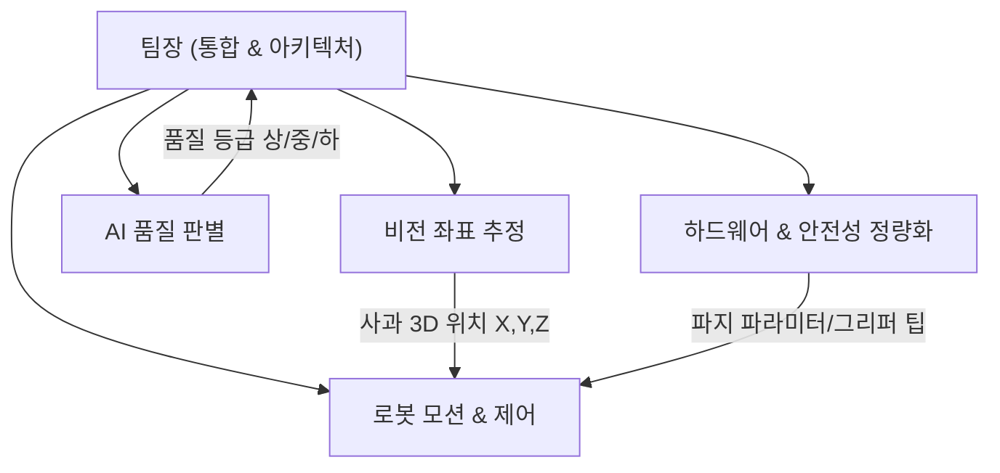
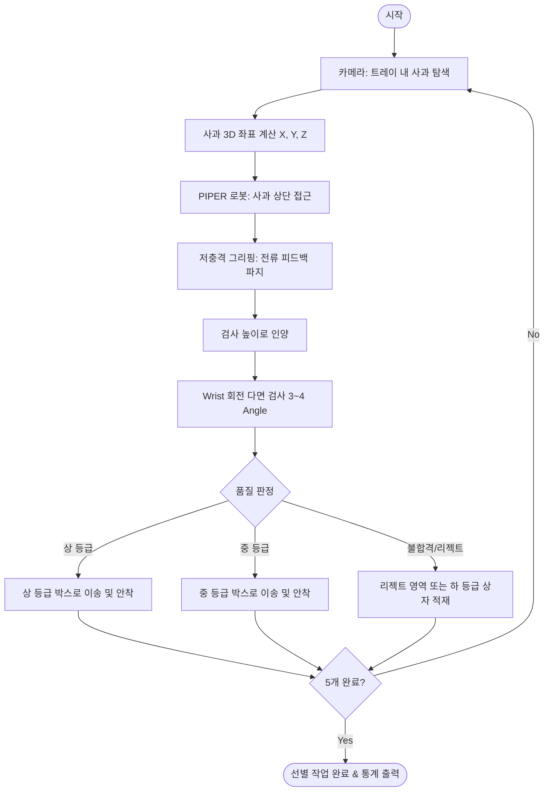

# PAC 2026 안동청과 미션(사과 품질 선별·포장 자동화) 기본 개발 계획서

본 문서는 **PAC 2026 분과 1: 안동청과 미션(사과 품질 선별·포장 자동화)** 참가를 위해 5인 팀이 수행할 전체 아키텍처, 비전 품질 판별 전략, 5인 최적 R&R(역할 분담), 단계별 마일스톤을 정의한 마스터 개발 계획서이다.

---

## 1. 미션 분석 및 평가 전략

### 1.1 기본 과제 vs 확장 과제(가산점 포인트)

| 구분 | 과제 내용 | 핵심 요구 역량 | 목표 달성치 |
| :--- | :--- | :--- | :--- |
| **기본 과제** | • 트레이 위 임의 위치 사과 5개 위치 파악 • PIPER 로봇으로 안정적 파지 • 색상 기준 2등급(상/중) 판별 • 등급별 상자 2개에 각각 적재 | • 2D/3D 객체 검출 및 좌표 변환 • 6축 매니퓰레이터 Pick & Place • 기본 색상 분석 알고리즘 | **성공률 100%** (오인식 0건, 낙하 0건) |
| **확장 과제 (수상 핵심)** | • **3등급(상/중/하) 분류 및 정확도 제시** • **사과를 집어 돌려가며 여러 면 검사(다면 검사)** • **파지력·낙하 높이 등 손상 방지의 정량적 근거 제시** • **등급 모호/불량 사과 리젝트(Reject) 처리** • **전체 사이클 타임(Cycle Time) 단축** | • 다면 비전 합성 및 딥러닝 품질 판정 • 전류/토크 기반 비파괴 파지 제어 • 상태 머신 기반 예외 분기 처리 • 부드럽고 빠른 궤적 최적화 | **심사위원 가산점 독점** (정량 데이터 리포트 제출) |

> [!IMPORTANT]
> 기본 과제는 출전 팀 대부분이 완수할 가능성이 높다. 따라서 본 대회의 수상 여부는 **"조명에 강인한 품질 판정 정확도"**, **"집어 회전시키는 다면 검사 완성도"**, **"멍 방지를 위한 파지력의 공학적/정량적 데이터 제시"**에서 갈린다.

---

## 2. 핵심 기술 난제: 비전 품질 판별 극복 전략

사용자가 영상 분석을 통해 지적한 것처럼, **실제 현장은 어둡고 반사광이 심하며 사과 표면이 불균일**하다. 이를 단순 RGB 임계값으로 접근하면 오판정 확률이 매우 높다.

### 2.1 색상 판별 파이프라인 (조명 불변성 확보)
1. **색공간 변환 (RGB → CIE-Lab & HSV)**:
   - RGB는 조명 밝기 변화에 매우 취약함.
   - 명도(L) 성분을 분리하고, 사과의 적색도와 착색 비율을 나타내는 **a* 채널(Green-Red 축)**과 **HSV의 Saturation(채도), Hue(색상)**를 기반으로 분석.
2. **사과 영역 정밀 마스킹 (Segmentation)**:
   - 배경(트레이/컨베이어) 및 그리퍼 손가락 영역을 완벽히 제외하기 위해 경량 세그멘테이션(YOLOv8-seg 또는 Color Thresholding + Contour 마스크) 적용.
   - 하이라이트(조명 반사로 하얗게 날아간 영역) 필터링 처리.
3. **착색 비율(Color Coverage Ratio) 정량화**:
   - $\text{착색률(\%)} = \frac{\text{붉은색 유효 픽셀 수}}{\text{전체 사과 표면 픽셀 수}} \times 100$
   - 기준: 상(밝고 붉은 착색률 80% 이상), 중(착색률 50~80%), 하/결점(50% 미만 또는 녹색/기형).

### 2.2 확장: 다면 검사(Multi-view Inspection) 시퀀스
- 바닥에 놓인 상태에서는 **사과의 윗면(1면)**만 보인다. 아래쪽에 멍이나 푸른 부분이 있으면 오판정된다.
- **해결 알고리즘**:
  1. 트레이에서 사과 파지 후 **검사 홈 포지션(Eye-to-Hand 카메라 전면)**으로 이동.
  2. 로봇팔의 Wrist 축(J5/J6)을 $+90^\circ, -90^\circ, 180^\circ$ 회전시키며 3~4개 프레임 캡처.
  3. 전체 면의 착색률 평균 및 국소 결점(멍/상처) 유무를 종합하여 최종 등급 산출.

---

## 3. 5인 팀 최적 R&R (역할 분담)

메카트로닉스공학부의 강점을 살려 소프트웨어(비전/제어)와 하드웨어(그리퍼/안전성)를 융합한 5인 체제:

| 팀원 | 역할 | 주요 담당 업무 및 산출물 |
| :---: | :--- | :--- |
| **팀원 1 (팀장)** | **시스템 통합 & 상태머신** | • 전체 시퀀스 제어(State Machine) 구현 • 노드 간 통신(ROS2 토픽/서비스 또는 멀티프로세스 IPC) • 예외 처리(파지 실패, 리젝트 처리, 타임아웃) 및 전체 일정 관리 |
| **팀원 2** | **비전 센싱 & 3D 위치 추정** | • 카메라 세팅(RGB-D 또는 단안) & Hand-Eye 캘리브레이션 • 트레이 위 사과 검출 및 중심점 3D 좌표 $(X, Y, Z)$ 계산 • 픽업 접근 벡터 및 법선 추정 |
| **팀원 3** | **AI 품질 판별 알고리즘** | • 색상 판별 알고리즘(HSV/Lab 착색도 분석) • 멍/스크래치/결점 검출 딥러닝 모델 경량화 • 다면 검사(회전 시 다중 프레임 결합) 최종 등급 판정 알고리즘 |
| **팀원 4** | **로봇 모션 & 궤적 제어** | • WeGo PIPER SDK / MoveIt2 기구학(IK/FK) 제어 • 충돌 방지 및 부드러운 궤적 생성 • 픽앤플레이스 시퀀스 구현 및 사이클 타임(동선) 최적화 |
| **팀원 5** | **하드웨어/그리퍼 & 안전성 정량화** | • 사과 손상 방지용 소프트 패드 그리퍼 3D 모델링/제작 • 모터 토크/전류 피드백 기반 최적 파지력 측정 및 정량 근거 도출 • 박스 적재 시 완충 배치 및 조명 지그(링 라이트/반사판) 구성 |

---

## 4. 시스템 아키텍처 및 작업 흐름

---

## 5. 단계별 개발 로드맵 (Milestones)

### Phase 1: 기본 기능 완벽 구현 (목표: 기본 과제 100% 클리어)
- **비전**: 트레이 위 사과 2D 바운딩 박스 검출 + 픽셀-로봇 좌표 매핑 (기본 캘리브레이션).
- **로봇**: WeGo PIPER 기본 SDK로 사과 픽업 후 상자 A, B에 내려놓는 기본 픽앤플레이스 완성.
- **분류**: 윗면 1회 캡처 기반 색상(밝은색/어두운색) 2분할 룰베이스 적용.

### Phase 2: 비전 고도화 및 품질 판별 정밀화 (사용자 핵심 관심사)
- 조명 노이즈 극복을 위한 **HSV + Lab 기반 적색도 히스토그램 & 착색 비율 알고리즘** 구축.
- 카메라 조명 환경 튜닝 (휴대용 링 라이트 또는 보조 조명 활용 검토).
- 사과의 입체 형상에 맞춘 3D 중심점 파지 정밀도 개선.

### Phase 3: 확장 과제 완성 (가산점 확보)
- **다면 검사**: 사과 파지 후 공중 회전 모션 + 연속 캡처 판정 파이프라인 완성.
- **안전 파지 정량화**: PIPER 그리퍼 전류값을 모니터링하여 사과 멍 발생 한계 압력 이하로 제어하는 정량 데이터 리포트 작성.
- **리젝트 분기**: 색상 기준 미달 또는 흠집 사과 분리 적재.

### Phase 4: 사이클 타임 단축 및 최종 리허설
- 로봇 가감속 프로파일 튜닝 (Waypoint 비동기 모션).
- 연속 5개 사과 처리 시간 측정 및 벤치마킹.
- 최종 발표용 데모 시연 및 기술 보고서 완성.

---

## 5. 로봇 플랫폼 사양 및 Physical AI (LeRobot) 연계 전략

사용자가 제공한 [WeGo PIPER 블로그](https://blog.wego-robotics.com/piper-piper-with-hugging-face-lerobot/), [WeGo PIPER 사양](https://wego-robotics.com/ur/PIPER.php), [Hugging Face SO-101 Docs](https://huggingface.co/docs/lerobot/so101), [TheRobotStudio SO-ARM100](https://github.com/TheRobotStudio/SO-ARM100), [Seeed Studio LeRobot 튜토리얼](https://wiki.seeedstudio.com/lerobot_so100m/#record-the-dataset)을 심층 분석한 결과:

### 5.1 WeGo PIPER vs SO-101 플랫폼 비교

| 항목 | WeGo PIPER (AgileX) | SO-101 / SO-ARM100 |
| :--- | :--- | :--- |
| **목적 및 성격** | 산업/연구용 고성능 6축 로봇팔 (대회 기본 제공) | 3D 프린팅 기반 저비용 오픈소스 로봇팔 (LeRobot 표준 레퍼런스) |
| **자유도 (DOF)** | 6축 + 그리퍼 (6-DOF) | 5축 + 그리퍼 (6-DOF) |
| **통신 방식** | **고속 CAN 버스 (USB-CAN)** | 직렬 시리얼 버스 (UART/USB, Feetech STS3215 등) |
| **가반하중/정밀도**| **1.5kg / 반복정밀도 ±0.1mm** | 약 0.2~0.5kg / 정밀도 수 mm (플라스틱 백래시 존재) |
| **모터 & 제어** | 일체형 산업용 브러시리스 모터 + 절대위치 인코더 + 토크 피드백 | 스마트 시리얼 서보모터 (기어 플라스틱) |
| **LeRobot 지원** | **공식 통합 지원** (`WeGo-Robotics/lerobot_piper`) | LeRobot 공식 기본 내장 지원 (`so101_follower` / `so101_leader`) |
| **대회 활용 가치** | **실제 현장 미션 수행 하드웨어 (1.5kg 페이로드로 사과 5개 연속 고속 파지)** | **연구실/자택에서 저비용으로 LeRobot 모방학습 파이프라인 사전 검증용** |

### 5.2 PAC 2026 연계 Physical AI (모방 학습) 전략

1. **대회의 본질 (Physical AI Challenge)**:
   - 대회명(PAC)과 WeGo PIPER의 LeRobot 지원이 일치하는 것은 우연이 아니다.
   - 단순 전통적 IK/FK 룰베이스를 넘어, **Hugging Face LeRobot(ACT / Diffusion Policy)을 활용한 사람 동작 모방 학습(Teleoperation → Policy Learning)**을 시도할 경우 엄청난 기술적 가산점을 얻을 수 있다.
2. **하이브리드 제어 아키텍처 제안**:
   - **글로벌 탐색 & 분류 (비전 룰베이스)**: 우리가 개발한 `apple_quality_detector`로 조명 불변 착색도 분석 및 상/중/하 판정 (연산 빠름, 100% 신뢰성).
   - **로컬 파지 & 멍 방지 모션 (LeRobot ACT 정책)**: 사과를 손상 없이 집어 올리고 박스에 완충 적재하는 섬세한 모션은 Leader-Follower 텔레옵 데이터셋(50회 에피소드)으로 학습된 ACT(Action Chunking with Transformers) 정책에 위임.
3. **SO-101을 통한 사전 R&D 전략**:
   - WeGo PIPER를 실물로 다루기 전, 팀원들이 저비용 SO-100/101 환경에서 `lerobot-record` 및 `lerobot-train` 파이프라인을 사전에 체득할 수 있음.

---

## 6. 단계별 개발 로드맵 (Milestones)

### Phase 1: 기본 기능 완벽 구현 (목표: 기본 과제 100% 클리어)
- **비전**: 트레이 위 사과 2D 바운딩 박스 검출 + 픽셀-로봇 좌표 매핑 (기본 캘리브레이션).
- **로봇**: WeGo PIPER 기본 SDK로 사과 픽업 후 상자 A, B에 내려놓는 기본 픽앤플레이스 완성.
- **분류**: 윗면 1회 캡처 기반 색상(밝은색/어두운색) 2분할 룰베이스 적용.

### Phase 2: 비전 고도화 및 품질 판별 정밀화 (사용자 핵심 관심사)
- 조명 노이즈 극복을 위한 **HSV + Lab 기반 적색도 히스토그램 & 착색 비율 알고리즘** 구축.
- 카메라 조명 환경 튜닝 (휴대용 링 라이트 또는 보조 조명 활용 검토).
- 사과의 입체 형상에 맞춘 3D 중심점 파지 정밀도 개선.

### Phase 3: 확장 과제 완성 (가산점 확보)
- **다면 검사**: 사과 파지 후 공중 회전 모션 + 연속 캡처 판정 파이프라인 완성.
- **안전 파지 정량화**: PIPER 그리퍼 전류값을 모니터링하여 사과 멍 발생 한계 압력 이하로 제어하는 정량 데이터 리포트 작성.
- **리젝트 분기**: 색상 기준 미달 또는 흠집 사과 분리 적재.
- **Physical AI 선택지**: PIPER 텔레옵 기반 LeRobot 데이터 수집 및 ACT 모델 학습 시험.

### Phase 4: 사이클 타임 단축 및 최종 리허설
- 로봇 가감속 프로파일 튜닝 (Waypoint 비동기 모션).
- 연속 5개 사과 처리 시간 측정 및 벤치마킹.
- 최종 발표용 데모 시연 및 기술 보고서 완성.

---

## 7. User Review Required (확인 및 의사결정 필요 사항)

> [!NOTE]
> 프로젝트 착수 전 팀원들과 아래 사항을 논의하자.

1. **제어 방식 전략**:
   - **옵션 1 (안정적 룰베이스)**: OpenCV 3D 좌표 추정 + PIPER Python SDK 기구학(IK) PTP 제어 (개발 빠름, 즉시 검증 가능).
   - **옵션 2 (혁신적 하이브리드 Physical AI)**: OpenCV 품질 판정 + Hugging Face LeRobot (ACT 정책) 파지 제어 (가산점 독점 가능, 텔레옵 데이터 수집 필요).
2. **카메라 구성**:
   - Eye-to-Hand (외부 고정) vs Eye-in-Hand (손목 장착)
3. **SO-101 실습 여부**:
   - 팀 내에 SO-100/101 하드웨어가 있거나 제작 예정인지? (연구실 내 LeRobot 실습용)

