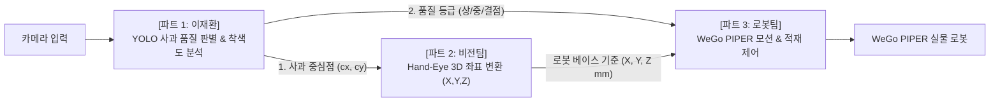

# PAC 2026 안동청과 미션 - 우분투 인수인계 & 전체 대화 요약서

본 문서는 Windows 세션에서 진행된 **PAC 2026 분과 1 안동청과 미션(사과 품질 선별·포장 자동화)**의 전체 기획, 아키텍처 분석, 하드웨어 레퍼런스, 기구현 코드 및 재환이의 YOLO 전담 파트 설정 내용을 우분투(Ubuntu) 환경에서 바로 이어서 개발할 수 있도록 집대성한 동기화 인수인계서이다.

---

## 1. 대회 및 미션 핵심 개요

- **대회명**: PAC 2026 (Physical AI Challenge)
- **참가 분과**: 분과 1 안동청과 미션 — **사과 품질 선별·포장 자동화**
- **기본 과제**:
  1. 트레이 위 임의 위치 사과 5개 탐색
  2. WeGo PIPER 로봇으로 안정적 파지
  3. 색상 기준 2등급(**상**: 밝은 색 / **중**: 어두운 색) 품질 판별
  4. 등급별 상자 2개에 적재
- **확장 과제 (심사위원 가산점 핵심)**:
  - 3등급(특/상/보통/리젝트) 분류 및 정확도 제시
  - 사과 파지 후 로봇 손목을 돌려가며 여러 면 검사 (다면 검사)
  - 파지력·낙하 높이 등 사과 손상(멍) 방지의 정량적 근거 제시 (전류/토크 데이터)
  - 등급 모호 사과 리젝트 처리 및 사이클 타임 단축
- **공장 현장 환경 특성 (영상 분석 결과)**:
  - 어두운 저조도 조명, 빠른 컨베이어 흐름, 사과 표면 반사광(Specular Highlight) 및 비대칭 그림자
  - $\rightarrow$ **"비전을 통한 사과 품질 판별"이 대회의 최대 승부처**

---

## 2. 5인 팀의 3개 파트 구성 및 재환이의 역할

우리 5인 팀은 아래와 같이 3개 핵심 파트로 분담되었으며, 재환이는 **전체 시스템의 눈과 두뇌에 해당하는 파트 1(YOLO 품질 학습 & 구분)의 파트장**을 맡음.



| 파트 | 담당자 | 주요 역할 및 책임 |
| :---: | :---: | :--- |
| **파트 1** | **이재환 (파트장)** | **YOLO 사과 외관 품질 딥러닝 모델 학습, 조명 불변 착색도 정량화, 실시간 추론 인터페이스 제공** |
| **파트 2** | 팀원 (2인) | 카메라 캘리브레이션, 사과 2D 픽셀 좌표 $\rightarrow$ WeGo PIPER 3D 로봇 좌표 $(X, Y, Z\text{ mm})$ 변환 |
| **파트 3** | 팀원 (2인) | WeGo PIPER 6축 기구학(IK/FK), LeRobot 모방학습 파지 모션, 다면 검사 회전 시퀀스, 상자 적재 |

### 파트 간 표준 데이터 규격 (`AppleDetectionItem`)
재환이의 모듈이 팀원들에게 넘겨주는 표준 출력 포맷:
```python
{
    "target_id": 1,
    "grade_korean": "상",             # -> [로봇팀] 상자 A(상) / 상자 B(중) / 리젝트 결정
    "confidence": 0.95,              # YOLO 모델 신뢰도
    "center_px": (320, 240),         # -> [좌표팀] 3D 로봇 좌표 (X, Y, Z)로 변환할 사과 중심점!
    "radius_px": 52,                 # 사과 반경
    "box_xyxy": (268, 188, 372, 292),# 바운딩 박스
    "color_ratio_phys": 99.1         # [가산점] 국립농산물품질관리원 기준 CIE-Lab 적색도 착색비율 (%)
}
```

---

## 3. 핵심 공식 레퍼런스 링크 모음

1. **WeGo PIPER 로봇팔 & Physical AI 연동**:
   - [위고로보틱스 PIPER with Hugging Face LeRobot 블로그](https://blog.wego-robotics.com/piper-piper-with-hugging-face-lerobot/)
   - [위고로보틱스 공식 lerobot_piper GitHub](https://github.com/WeGo-Robotics/lerobot_piper)
   - [WeGo PIPER 공식 제품 사양](https://wego-robotics.com/ur/PIPER.php) (6축, 가반 1.5kg, 반복정밀도 ±0.1mm, CAN 통신)
2. **Hugging Face LeRobot & SO-101 레퍼런스**:
   - [Hugging Face LeRobot SO-101 공식 문서](https://huggingface.co/docs/lerobot/so101)
   - [TheRobotStudio SO-ARM100 공식 GitHub](https://github.com/TheRobotStudio/SO-ARM100)
   - [Seeed Studio LeRobot SO-100 데이터셋 녹화 가이드](https://wiki.seeedstudio.com/lerobot_so100m/#record-the-dataset)
3. **공공 농산물 표준 규격 (심사위원 설득 정량 근거)**:
   - [국립농산물품질관리원 농산물 표준규격](https://www.naqs.go.kr) (사과 착색비율: 특 60~70% 이상, 상 40~50% 이상, 보통 20~30% 이상)
4. **사과 품질 오픈소스 데이터셋 (Roboflow Universe)**:
   - [Apple Quality Detection (cs LING)](https://universe.roboflow.com/cs-ling/apple-quality-detection)
   - [Apple Defect Detection](https://universe.roboflow.com/appledefectsdetection/apple-defect-detection-pkekm)
   - [Apple Quality Inspection](https://universe.roboflow.com/karens-workspace/apple-quality-inspection)
5. **YOLO 딥러닝 공식 문서**:
   - [Ultralytics YOLO Docs](https://docs.ultralytics.com)

---

## 4. 지금까지 구현 및 검증 완료된 파일 목록

모든 파일은 데스크톱-노트북 실시간 동기화 경로인 `G:\내 드라이브\Antigravity_Hub\projects\PAC2026_Andong_Apple\` 에 안전하게 저장되어 있음:

```
G:\내 드라이브\Antigravity_Hub\projects\PAC2026_Andong_Apple/
│
├── PAC2026_안동청과_기본개발계획서.md    # 전체 전략, 5인 R&R, LeRobot 하이브리드 아키텍처
├── README.md                           # 프로젝트 구조 및 모듈 실행 가이드
├── requirements.txt                    # torch, ultralytics, opencv, numpy 등 의존성
├── apple_quality_detector.py           # [CIE-Lab + HSV] 조명 불변 착색률 & 결점 분석 엔진
├── apple_locator.py                    # [트레이 사과 탐색] 2D 중심점 및 3D 로봇 좌표 변환기
├── test_quality_pipeline.py            # [가상 검증] 가상 트레이 5종 사과 품질 판정 시뮬레이션
├── quality_inspection_result.png       # 비전 판정 결과 시각화 이미지
│
└── yolo_quality/                       # [이재환 파트장 전용 디렉터리]
    ├── dataset_guide_and_strategy.md   # 데이터셋 수집/라벨링/증강 실전 가이드
    ├── apple_data_template.yaml        # YOLO 데이터셋 구조 정의 템플릿
    ├── train_apple_yolo.py             # 공장 저조도 맞춤 Data Augmentation YOLO 학습 스크립트
    ├── infer_apple_quality.py          # 실시간 추론 및 좌표팀/로봇팀 연동 인터페이스
    └── test_yolo_infer.py              # YOLO 추론 및 데이터 연동 테스트 스크립트
```

---

## 5. 우분투(Ubuntu) 부팅 후 즉시 실행할 액션 가이드

우분투로 부팅한 후 아래 순서대로 터미널에서 즉시 작업을 이어갈 수 있습니다:

### Step 1: 구글 드라이브(Antigravity_Hub) 프로젝트 폴더 접근
```bash
# 구글 드라이브 마운트 경로로 이동
cd "/path/to/Antigravity_Hub/projects/PAC2026_Andong_Apple"
ls -la
```

### Step 2: 우분투 파이썬 가상환경 생성 및 의존성 설치
```bash
# 가상환경 생성
python3 -m venv .venv
source .venv/bin/activate

# 필수 패키지 일괄 설치
pip install --upgrade pip
pip install -r requirements.txt
```

### Step 3: 재환이의 YOLO 파트 추론 테스트 동작 확인
```bash
cd yolo_quality
python test_yolo_infer.py
# -> 5개 사과의 [상/중] 등급 및 중심 좌표가 정상 출력되는지 확인!
```

### Step 4: 사과 데이터셋 다운로드 및 모델 학습 착수
1. 위의 [Roboflow Apple Quality](https://universe.roboflow.com/cs-ling/apple-quality-detection) 링크에서 `YOLOv8` 포맷으로 데이터셋 다운로드.
2. `yolo_quality/apple_dataset/`에 압축 해제.
3. 학습 실행:
   ```bash
   python train_apple_yolo.py --data apple_data_template.yaml --model yolo11n.pt --epochs 80 --device 0
   ```
4. 학습 완료 후 생성된 `runs/train_apple/apple_quality_v1/weights/best.pt`를 `infer_apple_quality.py`에 연결하여 실전 가동!
