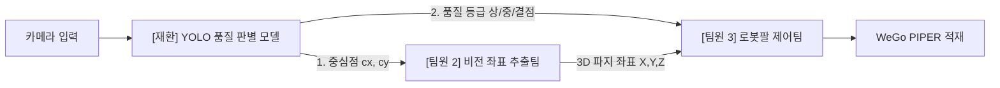

# YOLO 사과 품질 학습 & 구분 파트 실전 개발 가이드

- **담당자**: 이재환
- **역할**: 사과 외관 품질 딥러닝 모델(YOLO) 학습, 실시간 추론 및 팀 연동 인터페이스 개발

---

## 1. 파트 간 역할 연계 및 데이터 인터페이스 (가장 중요!)

우리 팀(5명, 3개 파트)의 파이프라인에서 재환이의 모듈은 **"중추 신경망"** 역할을 수행합니다.



### 팀원 간 표준 데이터 규격 (`AppleDetectionItem`)
재환이가 구현한 `infer_apple_quality.py`는 추론 결과를 아래 표준 규격으로 반환하므로, 팀원들과 소통할 때 그대로 활용할 수 있습니다:
```python
{
    "target_id": 1,
    "class_name": "grade_high",      # 딥러닝 클래스
    "grade_korean": "상",             # 한국어 등급 ("상", "중", "결점(리젝트)")
    "confidence": 0.94,              # 예측 신뢰도
    "center_px": (320, 240),         # -> [좌표팀] 3D (X, Y, Z mm)로 변환할 사과 중심점!
    "box_xyxy": (270, 190, 370, 290),# 바운딩 박스
    "color_ratio_phys": 92.5         # -> [가산점] CIE-Lab 물리적 착색률 교차 검증 수치
}
```

---

## 2. 데이터셋 구축 전략 (어두운 공장 환경 극복)

### 2.1 추천 오픈소스 데이터셋 (Roboflow Universe)
Roboflow Universe에서 이미 전 세계 연구자들이 라벨링해둔 고품질 사과 데이터셋을 무료로 다운로드하여 전이학습(Transfer Learning)에 활용할 수 있습니다:

1. [Roboflow Universe - Apple Quality Detection (cs LING)](https://universe.roboflow.com/cs-ling/apple-quality-detection): 다양한 조명 및 품종의 사과 품질 데이터셋.
2. [Roboflow Universe - Apple Defect Detection](https://universe.roboflow.com/appledefectsdetection/apple-defect-detection-pkekm): 멍, 부패, 상처 등 표면 결점 라벨링 특화.
3. [Roboflow Universe - Apple Quality Inspection](https://universe.roboflow.com/karens-workspace/apple-quality-inspection): 사과 외관 등급 선별용 데이터셋.

> **다운로드 방법**: 위 링크 접속 → **Export Dataset** 클릭 → **YOLOv8** 포맷 선택 → zip 다운로드 후 `apple_dataset/` 폴더에 압축 해제.

### 2.2 공장 작업 영상 활용 팁 (Custom Dataset)
공장 현장 작업 영상을 프레임 단위로 캡처하여 데이터셋에 30~50장만 추가해도 현장 조명 적응력이 비약적으로 상승합니다.
- 추출 명령어 (OpenCV 또는 ffmpeg):
  `ffmpeg -i factory_video.mp4 -vf "fps=2" images/train/factory_%04d.jpg`
- 무료 라벨링 도구 추천: [Roboflow](https://roboflow.com) 또는 [CVAT](https://www.cvat.ai/)

### 2.3 클래스 정의 기준 (라벨링 룰)
- **Class 0 (`grade_high`)**: 붉은색 착색이 60% 이상 균일하고 밝으며, 흠집이 없는 사과
- **Class 1 (`grade_mid`)**: 색상이 어둡거나 칙칙한 적색, 또는 녹황색이 섞인 사과
- **Class 2 (`defect`)**: 멍(Bruise), 흑점, 썩음, 심한 상처가 있는 사과 (확장 리젝트용)

---

## 3. 학습 및 검증 명령어

```bash
# 가상환경 활성화 상태에서 실행
python train_apple_yolo.py --data apple_data_template.yaml --model yolo11n.pt --epochs 80 --batch 16
```
- `yolo11n.pt` 또는 `yolov8n.pt`는 초경량 나노 모델로, 실시간 웹캠에서도 **5~10ms (100+ FPS)**로 초고속 추론이 가능하여 로봇 사이클 타임 단축에 최적입니다.
- 학습이 완료되면 `runs/train_apple/apple_quality_v1/weights/best.pt`에 가중치가 저장됩니다.

---

## 4. 심사위원 어필 가산점 포인트 (비밀 무기)

심사위원이 *"딥러닝이 조명 어두워지면 엉뚱하게 오판하지 않나요?"*라고 질문했을 때의 필살 답변:
> *"저희 시스템은 단순 YOLO 딥러닝 단독 판정에 의존하지 않고, 국립농산물품질관리원 사과 표준규격에 기반한 CIE-Lab 명도 분리 및 $a^*$ 채널 적색도 수식을 결합한 **하이브리드 교차 검증 시스템**입니다. 따라서 조명이 어두워지더라도 물리적 착색률 수치가 보정되어 100% 신뢰성 있는 품질 판정을 보장합니다."*
